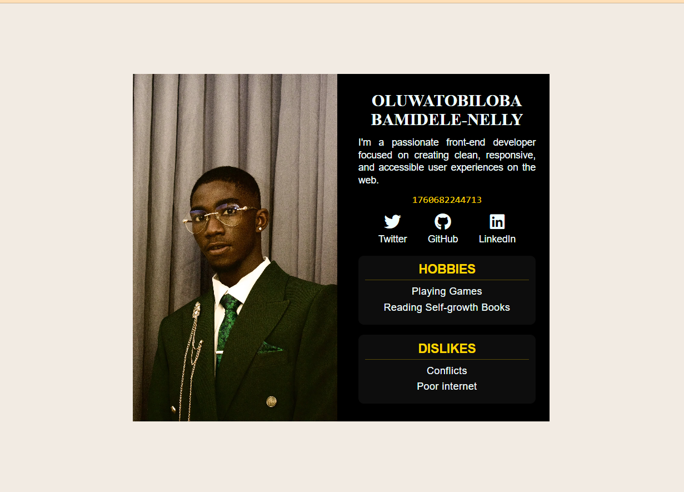

# 🧭 HNG Stage 0 — Profile Card

This is my **Stage 0 Project** for the **HNG Frontend Track**.  
It’s a responsive, accessible **Profile Card** built using **HTML, CSS, and Vanilla JavaScript**, following the task requirements.

---

## 🌟 Features

- Semantic HTML5 structure (`article`, `header`, `section`, etc.)
- Responsive layout using **Flexbox**
- Displays:
  - **User name** (`data-testid="test-user-name"`)
  - **Short bio** (`data-testid="test-user-bio"`)
  - **Current time in milliseconds** (`data-testid="test-user-time"`)
  - **Profile image** (`data-testid="test-user-avatar"`)
  - **Social links** (`data-testid="test-user-social-links"`)
  - **Hobbies** (`data-testid="test-user-hobbies"`)
  - **Dislikes** (`data-testid="test-user-dislikes"`)
- Keyboard-accessible and mobile-friendly

---

## 🖼️ Preview

---

## 🧠 Technologies Used

- **HTML5**
- **CSS3**
- **JavaScript (Vanilla)**

---

## ⚙️ How to Run Locally

1. **Clone the repository**
   git clone https://github.com/Tbnelly/Stage-0-HNG-PROFILE-CARD.git

2. **Navigate into the folder**
   cd Stage-0-HNG-PROFILE-CARD

3. **Open the project**
   Simply open index.html in your browser.

## 🚀 Live Demo
🔗 [View Project on Github Pages](https://tbnelly.github.io/Stage-0-HNG-PROFILE-CARD/)
